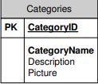
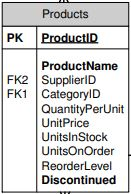
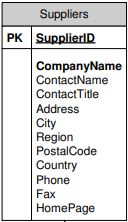
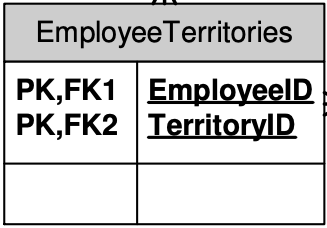
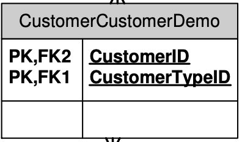

# dbproject
Autorzy: Adrian Nędza, Igor Dzierwa, Konrad Makuch

Komenda potrzebna do uruchomienia kontenerów (należy ją wpisać w root folderze projektu):
"docker-compose up -d --build" - uruchamia kontenery w tle, buduje je zawsze przed uruchomieniem (zalecane przy zmianach w kodzie backendu, można pominąć '--build' jeśli zmian w kodzie nie było)

# Budowanie obrazu northwind-service: 
mvn clean package -DskipTests (spotify maven plugin)

# Swagger3: 
localhost:8080/swagger-ui/index.html

# Project Lombok:
Biblioteka Javy, która w znaczącym stopniu ułatwia definiowanie klas, szczególnie klas modelu, które powinny być zgodne ze standardem JavaBeans lub być klasami dla obiektów niemodyfikowalnych (immutable).\
Rezultat: Znaczące skrócenie kodu poprzez zastąpienie wszystkich getter'ów i setter'ów adnotacjami @Getter oraz @Setter.

Link: https://javastart.pl/baza-wiedzy/frameworki/project-lombok

Plugin do dodania do InteliJ: https://plugins.jetbrains.com/plugin/6317-lombok (dependency również dodane).

# Opis bazy danych:
Categories – kategorie oferowanych produktów.\
Products – informacja o oferowanych produktach.\
Suppliers – informacja o dostawcach.\
Shippers – informacja o spedytorach.\
Customers – informacja o klientach.\
Employees – informacja o pracownikach.\
Orders – zamówienia składane przez klientów.\
OrderDetails – szczegóły zamówień.\
Territories – terytoria/obszary/miasta.\
Region – Regiony.\
EmployeeTerritories – informacja o terytoriach/obszarach/miastach (obslugiwanych przez poszczególnych pracowników).\
CustomerDemographics – grupy klientów.\
CustomerCustomerDemo – przyporządkowanie klientów do grup.

# Tabele baz danych wraz z proponowaną formą i opisem

### Categories:

Tabela SQL:\
 

Dokument NoSQL:
```
{
  "categoryName": "string",
  "description": "string",
  "id": "string",
  "picture": "string"
}
```
Dokument bazy NoSQL wygląda praktycznie tak samo jak tabela w bazie SQL.

### Products:

Tabela SQL:\
 

Dokument NoSQL:

```
{
  "category": {
    "categoryName": "string",
    "description": "string",
    "id": "string",
    "picture": "string"
  },
  "discontinued": true,
  "id": "string",
  "productName": "string",
  "quantityPerUnit": 0,
  "reorderLevel": 0,
  "supplier": {
    "address": "string",
    "city": "string",
    "companyName": "string",
    "contactName": "string",
    "contactTitle": "string",
    "country": "string",
    "fax": "string",
    "homePage": "string",
    "id": "string",
    "phone": "string",
    "postalCode": "string",
    "region": "string"
  },
  "unitPrice": 0,
  "unitsInOrder": 0,
  "unitsInStock": 0
}
```
W tym przypadku należało przełożyć relacje SQL na bazę NoSQL, co uzyskaliśmy poprzez zagnieżdżenie dokumentów - dane z obiektu Supplier jak i z obiektu Category w całości są przekazywane do dokumentu Products.

Jeśli chodzi o kwestię dodawania produktów, a raczej dodawania obiektu Supplier i Category to preferowaną przez nas opcją jest przekazanie samych parametrów categoryName/companyName, po których możemy odszukać daną kategorię/dostawcę.

### Suppliers:

Tabela SQL:\


Dokument NoSQL:
```
{
  "address": "string",
  "city": "string",
  "companyName": "string",
  "contactName": "string",
  "contactTitle": "string",
  "country": "string",
  "fax": "string",
  "homePage": "string",
  "id": "string",
  "phone": "string",
  "postalCode": "string",
  "region": "string"
}
``` 
Dokument bazy NoSQL wygląda praktycznie tak samo jak tabela w bazie SQL.

### Region:

Tabela SQL:\


Dokumet NoSQL:
```
{
  
}
``` 

### Territories:

Tabela SQL:\


Dokument NoSQL:
```
{
  
}
``` 

### EmployeeTerritories:

Tabela SQL:\


Dokument NoSQL:
```
{
  
}
``` 

### Employee:

Tabela SQL:\


Dokument NoSQL:
```
{
  
}
``` 

### CustomerDemographics:

Tabela SQL:\


Dokument NoSQL:
```
{
  
}
``` 

### CustomerCustomerDemo:

Tabela SQL:\


Dokument NoSQL:
```
{
  
}
``` 

### Customers:

Tabela SQL:\


Dokument NoSQL:
```
{
  
}
``` 
