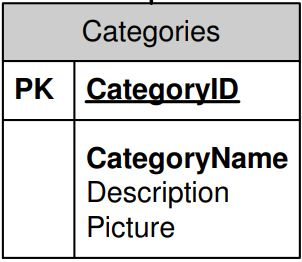
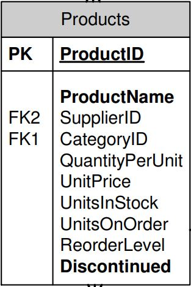
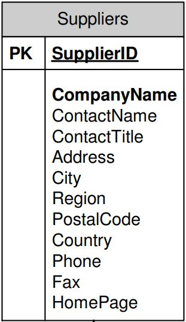
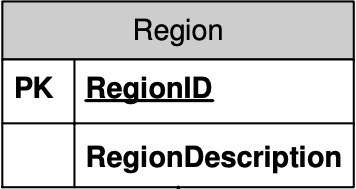
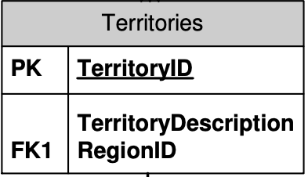
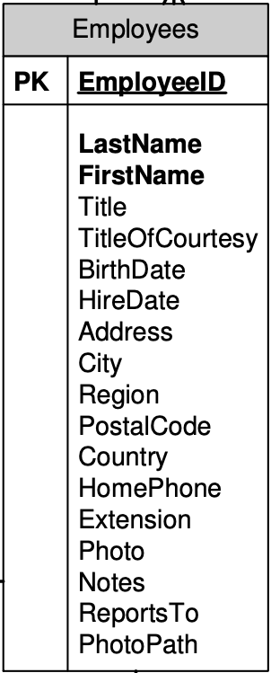
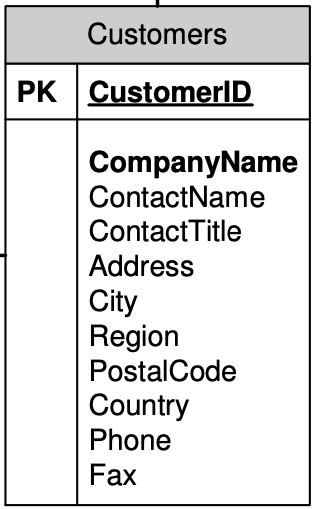
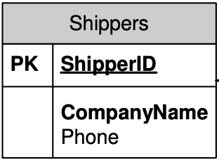
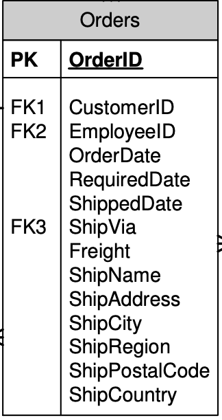

# dbproject
Autorzy: Adrian Nędza, Igor Dzierwa, Konrad Makuch

Komenda potrzebna do uruchomienia kontenerów (należy ją wpisać w root folderze projektu):
"docker-compose up -d --build" - uruchamia kontenery w tle, buduje je zawsze przed uruchomieniem (zalecane przy zmianach w kodzie backendu, można pominąć '--build' jeśli zmian w kodzie nie było)

# Budowanie kontenerów:
`docker-compose up -d` w głównym folderze - instalacja zależności frontu może trwać nawet 10 minut!

# Usunięcie kontenerów:
`docker-compose down` w głównym folderze

# Adres frontu:
https://localhost:9000

# Swagger3:
localhost:8080/swagger-ui/index.html

# Project Lombok:
Biblioteka Javy, która w znaczącym stopniu ułatwia definiowanie klas, szczególnie klas modelu, które powinny być zgodne ze standardem JavaBeans lub być klasami dla obiektów niemodyfikowalnych (immutable).\
Rezultat: Znaczące skrócenie kodu poprzez zastąpienie wszystkich getter'ów i setter'ów adnotacjami @Getter oraz @Setter.

Link: https://javastart.pl/baza-wiedzy/frameworki/project-lombok

Plugin do dodania do InteliJ: https://plugins.jetbrains.com/plugin/6317-lombok (dependency również dodane).

# Tabele baz danych wraz z proponowaną formą i opisem

### Categories:

Tabela SQL:\


Dokument Category:
```
{
  "id": "string",
  "categoryName": "string",
  "description": "string",
  "picture": "string"
}
```
Dokument bazy NoSQL wygląda praktycznie tak samo jak tabela w bazie SQL.

### Products:

Tabela SQL:\


Dokument Product:

```
{
  "id": "string",
  "supplierID": "string",
  "productName": "string",
  {
    "category": {
      "id": "string",
      "categoryName": "string",
      "description": "string",
      "picture": "string"
  },
  "quantityPerUnit": 0,
  "unitPrice": 0,
  "unitsInStock": 0,
  "unitsInOrder": 0,
  "reorderLevel": 0,
  "discontinued": true,
}
```
W tym przypadku należało przełożyć relacje SQL na bazę NoSQL, co uzyskaliśmy poprzez zagnieżdżenie dokumentów - obiekt Supplier i Category są przekazywane w postaci ich numerów id do dokumentu Products.

Jeśli chodzi o kwestię dodawania produktów, a raczej dodawania obiektu Supplier i Category to preferowaną przez nas opcją jest przekazanie samych parametrów categoryName/companyName, po których możemy odszukać daną kategorię/dostawcę.

### Suppliers:

Tabela SQL:\


Dokument Supplier:
```
{
  "id": "string",
  "companyName": "string",
  "contactName": "string",
  "contactTitle": "string",
  "address": "string",
  "region": "string",
  "postalCode": "string",
  "city": "string",
  "country": "string",
  "phone": "string",
  "fax": "string",
  "homePage": "string",
}
```
Dokument bazy NoSQL wygląda praktycznie tak samo jak tabela w bazie SQL.

### Regions:

Tabela SQL:\


Dokumet Region:
```
{
  "id": "string",
  "regionDescription": "string"
}
```
Dokument bazy NoSQL wygląda praktycznie tak samo jak tabela w bazie SQL.


### Territories:

Tabela SQL:\


Dokument Territory:
```
{
  "id": "string",
  "territoryDescription": "string",
  "region": {
    "id": "string",
    "regionDescription": "string"
  },
}
```
W tym przypadku należało przełożyć relacje SQL na bazę NoSQL, co uzyskaliśmy poprzez zagnieżdżenie dokumentów - dane z obiektu Region, w całości są przekazywane do dokumentu Territories.

Jeśli chodzi o kwestię dodawania obiektu Region, to preferowaną przez nas opcją jest przekazanie samego parametru: regionDescription, po których możemy odszukać dany region.

### Employees:

Tabela SQL:\


Dokument Employee:
```
{
  "id": "string",
  "lastName": "string",
  "firstName": "string",
  "title": "string",
  "titleOfCourtesy": "string",
  "birthDate": "2020-12-09T11:38:34.146Z",
  "hireDate": "2020-12-09T11:38:34.147Z",  
  "address": "string",
  "city": "string",
  "region": "string",
  "postalCode": "string",
  "country": "string",
  "homePhone": "string",
  "extension": "string",
  "photo": "string",
  "notes": "string",
  "reportsTo": "string",
  "photoPath": "string",
  "employeeTerritories": [
    {
      "id": "string",
      "territory": {
        "id": "string",
        "territoryDescription": "string",
        "region": {
          "id": "string",
          "regionDescription": "string"
        }
      }
    }
  ],
}
```
W tym przypadku należało przełożyć relacje SQL na bazę NoSQL, co uzyskaliśmy poprzez zagnieżdżenie dokumentów - obiekty EmployeeTerritories są przekazywane w całości, w postaci listy, do dokumentu Employee.


### CustomerDemographics:

Tabela SQL:\


Dokument CustomerDemographic:
```
{
  "id": "string"
  "customerDesc": "string",
}
```
Dokument bazy NoSQL wygląda praktycznie tak samo jak tabela w bazie SQL.


### Customers:

Tabela SQL:\


Dokument Customer:
```
{
  "id": "string",
  "companyName": "string",
  "contactName": "string",
  "contactTitle": "string",
  "address": "string",
  "city": "string",
  "region": "string",
  "postalCode": "string",
  "country": "string",
  "phone": "string",
  "fax": "string",
  "customerCustomerDemo": [
    {
      "customerDemographic": {
        "customerDesc": "string",
        "id": "string"
      },
      "id": "string"
    }
  ],
}
```
W tym przypadku należało przełożyć relacje SQL na bazę NoSQL, co uzyskaliśmy poprzez zagnieżdżenie dokumentów - obiekty customerCustomerDemo są przekazywane w całości, w postaci listy, do dokumentu Customers.


### Shippers:

Tabela SQL:\


Dokument Shipper:
```
{
  "id": "string",
  "companyName": "string",
  "phone": "string"
}
```
Dokument bazy NoSQL wygląda praktycznie tak samo jak tabela w bazie SQL.

### Orders:

Tabela SQL:\


Dokument Order:
```
{
    "id": "string",
    "customerID": "string",
    "employeeID": "string",
    "orderDate": "2020-12-09T12:22:51.964Z",
    "requiredDate": "2020-12-09T12:22:51.964Z",
    "shippedDate": "2020-12-09T12:22:51.964Z",
    "shipperID": "string",
    "freight": "string",
    "shipName": "string",
    "shipAddress": "string",
    "shipCity": "string",
    "shipRegion": "string",
    "shipPostalCode": "string",
    "shipCountry": "string",
    "orderDetails": [
      {
        "productName": "string",
        "unitPrice": 0,
        "quantity": 0,
        "discount": 0
      }
    ]
  }
```
W tym przypadku należało przełożyć relacje SQL na bazę NoSQL, co uzyskaliśmy poprzez zagnieżdżenie dokumentów - dane z obiektu Customer, Employee oraz Shipper
są przekazywane w postaci ich numerów id do dokumentu Orders, natomiast obiekty OrderDetails przekazywane są w całości, w postaci listy, do dokumentu Orders.

Jeśli chodzi o kwestię dodawania obiektów Customer, Employee oraz Shipper to preferowaną przez nas opcją jest przekazanie samych parametrów: companyName(Customer)/firstName+lastName(Employee)/companyName(Shipper), po których możemy wyszukać te obiekty.
